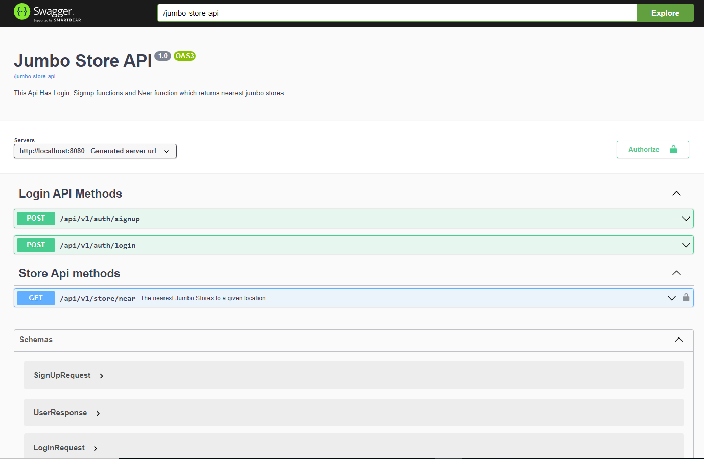

# jumbo-stores
Rest API which return closest stores to a given location.


<!-- ABOUT THE PROJECT -->
## About The Project

Rest API which returns nearest jumbo stores to a given location;
* Spring Boot,
* Java 17
* MongoDB
* JWT
* OpenAPI 3.0 (Swagger 3)
* Junit 5


<!-- GETTING STARTED -->
## Getting Started

To get a local copy up and running follow these simple steps.

### Prerequisites

* Clone the application

```sh
git clone https://github.com/demirorens/jumbo-stores.git
```

### Installation Without Docker
1. Install MongoDB latest version

2. Build app
```sh
mvn clean package -DskipTests=true
```
3. Run the app using maven

```sh
mvn spring-boot:run
```
The app will start running at <http://localhost:8080>


### Installation With Docker

1. Build app
```sh
mvn clean package -DskipTests=true
```
2. In jumbo-stores directory run
```sh
docker-compose up -d
```
The app will start running at <http://localhost:8080>

<!-- USAGE EXAMPLES -->
## Usage
For testing you can use admin (username= "admin", password="123456"), or you can signup new user and than login. To use "near" method of api, first you must login and get access-token. Than you must authorize with using authorize button on sawagger ui, and entering the access-token the token field. 
To inspect and use for the API just open the swagger-ui with below link
<http://localhost:8080/swagger-ui.html>



<p align="right">(<a href="#top">back to top</a>)</p>

